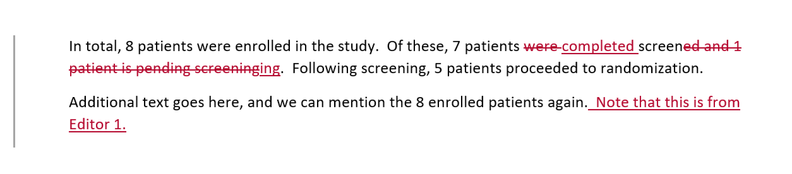
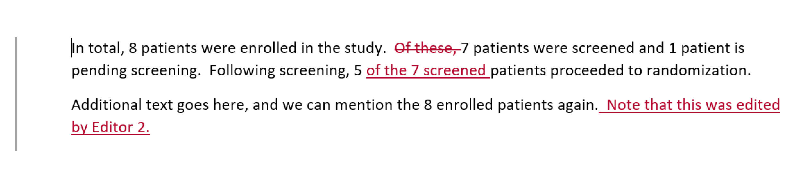
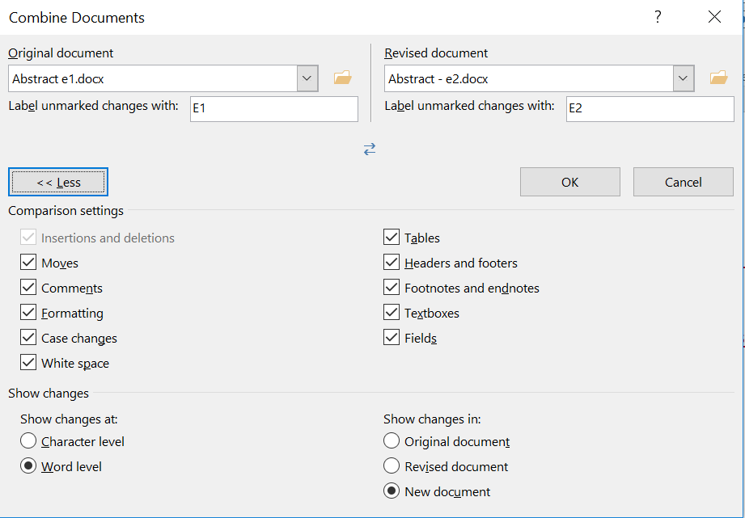
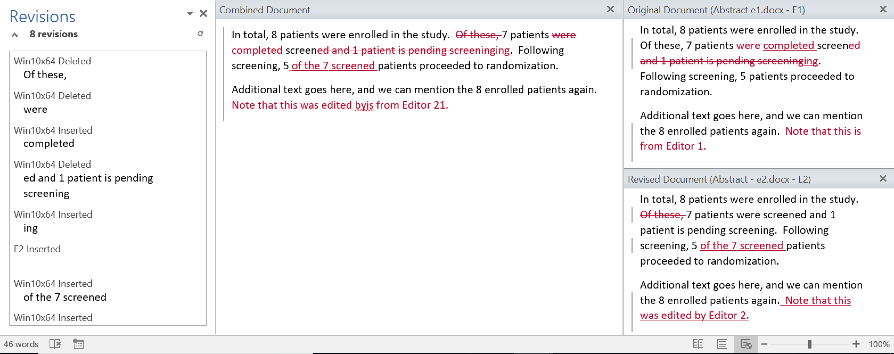

# Test Scenario - Merge Word Documents

**Objective**: To ensure that StatTag fields are merged properly by Microsoft Word when two documents are merged together after having been revised.

**Data**: Files contained in [MergeTest.zip](./files/MergeTest.zip)

**Steps**:

1. We start with an author creating the original Word document, stored in the `Original` folder.  This file is linked to the local `CONSORT Analysis2.R` code file.
2. This is distributed to two collaborators, Editor1 and Editor 2.
3. Editor1 enabled 'Track Changes' in Microsoft Word, and using StatTag re-links the code file to their local path (stored in the `Editor1` folder).  Editor1 then modifies the text, including deleting one of the tags in the text.

	

4. Editor2 also enabled 'Track Changes', and renamed the code file locally to `CONSORT Analysis-test.R`.  This is linked to the Word document from their local path (stored in the `Editor2` folder).  Editor2 makes changes to the text, including copying and pasting one of the tags as part of their edits.

	

5. The original author receives both of the edited files and places them in `Resolved`.  From the 'Review' tab in Microsoft Word, they select Compare > Combine.  They choose Editor1's document as the original, and Editor2's document as the revised.

	
	
6. The combined document looks like this:

	

7. There are changes needed, but we are able to accept all of the edits in the document, and make some modifications to the text as we see fit.  All of the remaining tags are preserved.
8. In the course of the merge, the properties from Editor1 were kept within the document. This means that the path Editor1 used for the code file is what is preserved.  Because the original author has this at a new location, it requires them to re-link the code file and update the tags to be pointed to the "correct" file.  At this point, updates and re-running the code file correctly populate within the combined Word document.  The final result can be seen at `Abstract-Resolved.docx`.