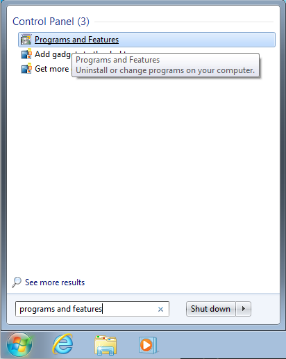
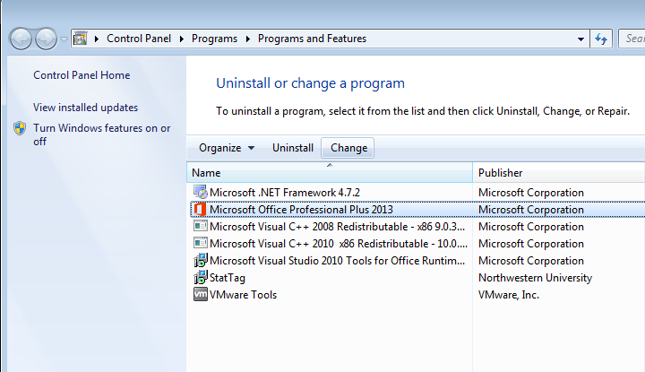
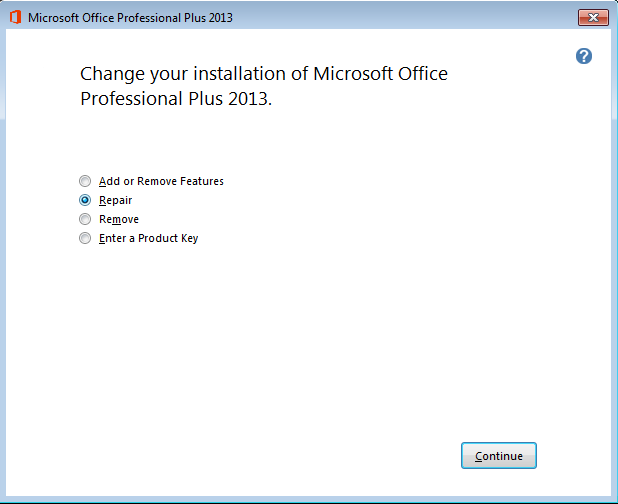

# Troubleshooting StatTag

This is a collection of the team's troubleshooting tips and tricks for various problems.  While users are more than welcome to see this information, it is not "user friendly" for all users and so may be kept out of the primary documentation/FAQs.

## StatTag Add-In Not Showing (Windows)

Within Windows, after you install StatTag it may not appear in the Word toolbar.  Here are a set of steps to help troubleshoot what is going on.

**1. Do you have Administrative rights?**
StatTag requires Administrative rights on your machine to be successfully installed.  You may need to re-run the installer as an administrator (right click -> Run as Administrator) if you think this did not happen.  If you do not have administrative rights, you may need to work with your local IT group on installing StatTag.

**2. Check if the add-in installed, but isn't loading**

**3. See what's going on in the registry**
Run RegEdit, and ensure that a key exists at:
`HKEY_LOCAL_MACHINE\SOFTWARE\Microsoft\Office\Word\Addins\NorthwesternUniversity.StatTag`

If no key exists, it means StatTag wasn't installed.  This can happen if you try and install a 32-bit version of StatTag on a machine with a 64-bit version of Microsoft Word.

If the key exists, check to see what the value of `LoadBehavior` is. We expect a value of 3, which means it's connected, and will load at startup.  More information about this troubleshooting step and the meaning of the `LoadBehavior` value can be found at: [https://support.microsoft.com/en-us/help/824251/the-com-add-in-that-you-added-to-the-templates-and-add-ins-list-is-not](https://support.microsoft.com/en-us/help/824251/the-com-add-in-that-you-added-to-the-templates-and-add-ins-list-is-not).


## Unable to cast COM object of type 'Microsoft.office.Interop.Word.ApplicationClass'

### Problem ###
This was first reported by a user in July 2019.  The user indicated that they are using Microsoft Word 2013 32-bit on Windows 7 Professional, but this error is not yet localized to any version of Office or Windows.

StatTag installed just fine, but when running Word the following error appears:

```
An unexpected error occurred when trying to gather your system information.  Please report this to StatTag@northwestern.edu.
Unable to cast COM object of type 'Microsoft.Office.Interop.Word.ApplicationClass' to interface type 'Microsoft.Office.Interop.Word._Application'. This operation failed because the QueryInterface call on the COM component for the interface with IID '{00020970-0000-0000-C000-000000000046}' failed due to the following error: Library not registered. (Exception from HRESULT: 0x8002801D (TYPE_E_LIBNOTREGISTERED)).
 
   at System.StubHelpers.StubHelpers.GetCOMIPFromRCW(Object objSrc, IntPtr pCPCMD, IntPtr& ppTarget, Boolean& pfNeedsRelease)
   at Microsoft.Office.Interop.Word.ApplicationClass.get_Version()
   at StatTag.ThisAddIn.GetUserEnvironmentDetails(Boolean fullDetails)
``` 

### Investigation ###
Per [1], it seems that this is related to registry settings being incorrect or missing regarding the Application class.  In my initial development instance, the registry key that relates to Microsoft.Office.Interop.Word.ApplicationClass is `HKEY_LOCAL_MACHINE\SOFTWARE\Classes\CLSID\{000209FF-0000-0000-C000-000000000046}`.  Note that the GUID differs.

### Reproduce the problem ###
Per the information in [1], I attempted to edit the entries under GUID 000209FF-0000-0000-C000-000000000046 to have the wrong version.  My hope is that it would cause the assembly to not be found.  I tried editing the version (setting it a version ahead (15 -> 16)), and changing the PublicKeyToken.  This did not cause the error to appear, however we know that the registry entries are wrong.

Next up, we're going to break the entries in 00020970-0000-0000-C000-000000000046.  Searching for this in the registry, I changed all of the associated CLSID values by prefixing them with FFF instead of 000.  I rebooted after making those changes, and it produced a slightly different error - maybe close enough though?

```
Unable to cast COM object of type 'System.__ComObject' to interface type 'Microsoft.Office.Interop.Word._Application'.
This operation failed because the QueryInterface call on the COM component for the interface with IID '{00020970-0000-0000-C000-000000000046}' failed due to the following error:
No such interface supported (Exception from HRESULT: 0x80004002 (E_NOINTERFACE)).
```

We'll try the suggested fix of repairing Office.  From the Programs and Features:



I click on Microsoft Office 2013 and click the "Change" button.



From the dialog, I select "Repair".




After that's done, and I reboot, it appears to have fixed the issue.

**References**

[1] [https://answers.microsoft.com/en-us/msoffice/forum/msoffice_word-mso_other/unable-to-cast-com-object-of-type/34efcd57-e819-4a83-9cdd-501ab15b0971](https://answers.microsoft.com/en-us/msoffice/forum/msoffice_word-mso_other/unable-to-cast-com-object-of-type/34efcd57-e819-4a83-9cdd-501ab15b0971)