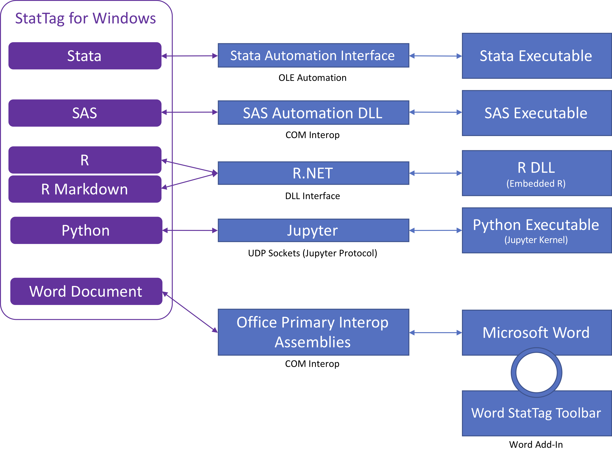

# Interaction with Statistical Programs

StatTag has dedicated modules for interacting with different statistical programs.  Each module is responsible for any language-specific pre-processing, and for handling the actual interaction with the statistical program’s API to send code and to get back results. The design provides a consistent interface between the statistical programs and the rest of StatTag.

* *Stata*.  For Stata, StatTag uses the Stata Automation API ([https://www.stata.com/automation/](https://www.stata.com/automation/)), which is implemented using OLE Automation.  Therefore, StatTag has a registered interface to make calls against (i.e., StatTag is the Automation Client). The Stata executable receives those calls and executes them (i.e., Stata is the Automation Server).
* *SAS*.  SAS automation uses a series of DLLs that are included within StatTag to facilitate communication with SAS instances.  These DLLs are integrated into StatTag and the .NET framework via COM Interop.  StatTag currently supports communication with locally running SAS instances.
* *R*.  Unlike the other environments, integration with R does not invoke an R executable.  The core of R’s functionality is available within system libraries, which StatTag calls within an embedded instance of R.  Communication with R on Windows is handled primarily by the open source R.NET library ([https://github.com/rdotnet/rdotnet](https://github.com/rdotnet/rdotnet)).  This library handles many of the technical details regarding memory management and the underlying C API calls that make up R.  The R Markdown module inherits the majority of its functionality from the R module, but because of specific pre- and post-processing needs, it is implemented as a separate module.
* *Python*.  The Jupyter protocol ([https://jupyter-client.readthedocs.io/en/stable/index.html](https://jupyter-client.readthedocs.io/en/stable/index.html)) and the IPyKernel Python kernel facilitate Python automation.  Using the Jupyter protocol, StatTag will instantiate an instance of the IPyKernel which allows communication over several UDP connections, and provides access via messages to the Python environment, the details of which depend on the configuration of IPyKernel.
